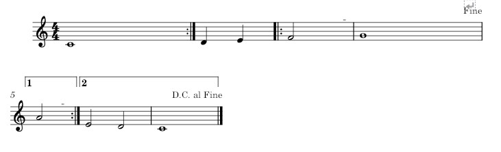

---
# Title, summary, and page position.
linktitle: Repetition Handling
summary: Learn how Partitura and the Match Format handles repetitions during the performance's score unfolding.
weight: 4

# Page metadata.
title: Repetition Handling
date: "2018-09-09T00:00:00Z"
type: book  # Do not modify.
---

## Repetition Handling

### Some background

Currently the repeat object is a simple *TimedObject* with start and end time.

Repeat objects are read from xml barline objects with repeat and Volta brackets are read from barline objects with "ending" property in `partitura.score.Ending` obejects and have a number property.

This allows for the creation of *ScoreVariants* based on *Repeats* for the unfolding of parts.

There are several limit cases to unfolding/segmentation:

- the endpoint of Ending objects (encoding a Volta bracket) is not automatically inferred
- Volta brackets with >2 endings are not supported
- Nested repeats are not supported
- all other navigation marks (segno, coda, capo, fine, ...?) are not supported

The *ScoreVariant* itself allows for segment-type/jump-type-agnostic *ScoreVariants*. As far as I understand the ScoreVariant contains a segment list of the structure:

```
sv.segments = [(0,6,0),(0,6,6)(6,10,12)]
```

where the three numbers mean (start of segment, end of segment, cumulative/unfolded start of segment)

see this example by Francesco:



where the possible omissions of repeats lead to these four segment lists:

```
[(0, 4, 0), (4, 6, 4), (6, 12, 6), (14, 22, 12)] [(0, 4, 0), (4, 6, 4), (6, 14, 6), (6, 12, 14), (14, 22, 20)] [(0, 4, 0), (0, 4, 4), (4, 6, 8), (6, 12, 10), (14, 22, 16)] [(0, 4, 0), (0, 4, 4), (4, 6, 8), (6, 14, 10), (6, 12, 18), (14, 22, 24)]
```

These segments and the corresponding ScoreVariants are created from the Repeat objects. As you can see the da capo and fine are ignored. but segments can also be added to a ScoreVariant, they are just defined by positions.

## my proposal for a Segment object

I think these problems of unfolding could be solved with a partitura.score.Segment object:

```
class Segment(TimedObject):    """Class that represents any segment between two navigation markers     Parameters    ----------    id : int/string        The ID associated with this segment    jump_to : list of int/string        The IDs of segments where the unfolded score could jump to at the end of this segment     Attributes    ----------    id : int/string        See parameters    jump_to : list of int/string        See parameters    jump_id : int        the id     """     def __init__(self, id, jump_to):        super().__init__()        self.id = id        self.jump_to = jump_to        self.jump_id = 0 
```

Let's go back to the score example above. This part would contain 5 segments:

- the first 4 beats, let's call it a
- the beats 4 - 6 : b
- 6 - 12 : c
- 12 - 14 : d
- 14 - 22 : e

and their jump_to properties would look like this:

```
a.jump_to = ["a", "b"] b.jump_to = ["c"] c.jump_to = ["d", "e", end] d.jump_to = ["c"] e.jump_to = ["a", end] # since it would be an option to not play the da capo?
```

